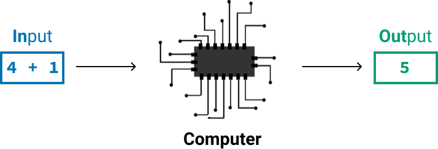

# Python para la ciencia de datos: Fundamentos, parte I {-}

Programando en Python

Aprenda los conceptos básicos de la programación en Python.

## Programando en Python {-}

### 1. Aprendiendo ciencia de datos {-}

**Aprender**

¡Bienvenido a **Python para la ciencia de datos: Fundamentos, Parte I**!

Si se está sumergiendo en la ciencia de datos por primera vez, aprender a programar en Python va de la mano con aprender los fundamentos de la ciencia de datos. No hay límite para lo que puede hacer aprendiendo ciencia de datos, y expandir su conjunto de habilidades significa expandir sus oportunidades profesionales y su potencial de ingresos.

Hemos diseñado este curso para principiantes, no se requiere experiencia previa en matemáticas, estadísticas o programación, para que pueda comenzar a aprender de inmediato.

Aquí hay algunas conclusiones que puede esperar al final de esta lección:

- ¿Cómo funcionan los programas de computadora?
- ¿Cómo escribir y ejecutar programas de computadora?
- ¿Cómo realizar operaciones matemáticas en Python?
- ¿Cómo usar comentarios de código?

Al final de este curso, sabremos cómo hacer lo siguiente:

- Guardar valores usando variables
- Trabajar con números y datos de texto
- Leer un gran conjunto de datos en Python y analizarlo
- Responder preguntas usando declaraciones condicionales

Por ahora, haga clic en el Nextbotón de abajo para comenzar a aprender a programar en Python.

### 2. Programando en Python {-}

**Aprender**

```{r}

```

Fuentes de imagen: [imagen de la izquierda](https://en.wikipedia.org/wiki/Autonomous_car#/media/File:Waymo_Chrysler_Pacifica_in_Los_Altos,_2017.jpg), [imagen del medio](https://www.flickr.com/photos/erikbenson/25717574115), [imagen de la derecha](https://commons.wikimedia.org/wiki/File:Google_Assistant_logo.svg).

Para construir tecnologías de ciencia de datos, necesitamos darle a la computadora las instrucciones adecuadas para aprender de los datos. Cuando le damos instrucciones a una computadora, decimos que la estamos **programando**.

Para programar una computadora, necesitamos escribir las instrucciones en un lenguaje especial, que llamamos **lenguaje de programación**. En esta lección, comenzaremos a aprender Python, el lenguaje de programación más popular para la ciencia de datos.

**Instrucciones**

1. Indique a la computadora que sume dos números `23 + 7`, y devuelva el resultado. Para hacer eso, deberá hacer lo siguiente:

- Escriba la instrucción `print(23 + 7)` en el editor de código de la derecha.
- Haga clic en correr el programar.

**Respuesta**

```{python}
print(23 + 7)
```

### 3. El comando print() {-}

**Aprender**

En el ejercicio anterior, se ha dado instrucciones al ordenador para realizar un cálculo simple: `print(23 + 7)`. La computadora siguió las instrucciones y regresó `30` como resultado.

Sin embargo, podemos pedirle a la computadora que realice más de un cálculo.

En el siguiente ejemplo, por ejemplo, le indicamos a la computadora que realice dos cálculos:

```{python, eval = FALSE}
print(23 + 7)
print(10 - 6)

Output
30
4
```

Para mostrar ambos resultados necesitamos usar el comando `print()`.

Ahora practiquemos el uso del comando `print()` con más de un cálculo.

**Instrucciones**

1. Con el comando `print()`, muestre los resultados de las siguientes operaciones:

- `40 + 4`
- `200 - 25`

2. Haga clic en correr el programar cuando esté listo para verificar su respuesta.

**Respuesta**

```{python}
print(40 + 4)
print(200 - 25)
```

### 4. Sintaxis de Python {-}

**Aprender**

Anteriormente, enviamos a la computadora dos instrucciones y escribimos cada una en una línea separada. Si los pusiéramos a ambos en la misma línea, obtendríamos un error:

```{python, eval = FALSE}
print(23 + 7) print(10 - 6)

Output
    print(23 + 7) print(10 - 6)
                  ^
SyntaxError: invalid syntax
```

`print(23 + 7) print(10 - 6)` resultó en texto que describe un **error de sintaxis**. Esto se debe a que todos los lenguajes de programación, incluido Python, tienen reglas de sintaxis. Cada línea de instrucciones debe cumplir con estas reglas.

Esto es similar a las reglas de sintaxis que seguimos en los lenguajes verbales. Si desea decirle a un amigo que le gusta la ciencia de datos en inglés, debe seguir las reglas de sintaxis para transmitir correctamente su mensaje. Tu amigo entenderá "Me gusta la ciencia de datos", pero no "la ciencia que me gustan los datos". De manera similar, la computadora no entendió dos declaraciones `print()` en una línea porque la sintaxis era incorrecta.

Es común encontrar errores cuando estamos programando, y constantemente aprenderemos acerca de los errores y cómo solucionarlos. Ahora practiquemos dando más instrucciones a la computadora.

**Instrucciones**

1. Ejecute las instrucciones a continuación en el editor de código a la derecha de la pantalla. Recuerde que cada instrucción debe estar en una línea separada.

```{python, eval = FALSE}
print(30 + 10 + 40)
print(4)
print(-3)
```

**Respuesta**

```{python}
print(30 + 10 + 40)
print(4)
print(-3)
```

### 5. Programas de computador {-}

**Aprender**

En el ejercicio anterior, le dimos a la computadora tres instrucciones:

```{python, eval = FALSE}
print(30 + 10 + 40)
print(4)
print(-3)
```

En conjunto, llamamos a todas estas instrucciones **código**. Llamamos a cada *línea* de instrucción una **línea de código**.

Cuando escribimos código, *programamos* la computadora para que haga algo. Por esta razón, también llamamos al código que escribimos un **programa de computadora** (o un **programa**). El programa que escribimos en el ejercicio anterior tenía tres líneas de código, pero un programa puede ser tan pequeño como una línea.

El código que escribimos sirve como **entrada** (o **input**) a la computadora. Llamamos al resultado de ejecutar el código de **salida** (o **output**).

```{r}

```

Como hemos aprendido, podemos mostrar la salida usando el comando `print()`. Sin embargo, tenga en cuenta que Python ejecuta el código independientemente de si se usa `print()` o no. En el siguiente ejemplo, vemos que la salida de `2 + 3` no se muestra porque no se especifica `print()`.

```{python, eval = FALSE}
2 + 3
print(5 + 4)

Output
9
```

Ahora practiquemos escribiendo más código. En la siguiente pantalla, aprenderemos sobre los comentarios de código.

**Instrucciones**

1. Con el comando `print()`, escriba un programa que tenga tres líneas de código y haga lo siguiente:

- Muestre el resultado de `34 + 16`
- Muestre el número `34`
- Muestre el número `-34`

2. Ejecute el programa que escribió haciendo clic en el Run Codebotón.

3. Verifique el programa que escribió haciendo clic en correr el programar cuando esté listo para verificar su respuesta.

**Respuesta**

```{python}
print(34 + 16)
print(34)
print(-34)
```

### 6. Comentarios de código {-}

**Aprender**

La computadora ejecuta código desde la primera línea hacia abajo e ignora las líneas en blanco.

```{python, eval = FALSE}
print(5 + 1)

print(8 - 7)

Output
6
1
```

Además de las líneas en blanco, la computadora también ignora cualquier secuencia de caracteres que venga a la derecha del #símbolo. En el siguiente ejemplo, usamos #antes print(5 + 1)y vemos que la salida de print(5 + 1)ya no se muestra, esto se debe a print(5 + 1)que no se ejecuta cuando lo #precede.

```{python, eval = FALSE}
#print(5 + 1)

print(8 - 7)

Output
1
```

La secuencia de caracteres que sigue al #símbolo se denomina comentario de código . Podemos usar comentarios de código para agregar información sobre nuestro código:

```{python, eval = FALSE}
print(5 + 1)

print(8 - 7) # This line outputs 1

Output
6
1
```

Otra forma en que podemos usar los comentarios de código es agregando una descripción general al comienzo de nuestro programa.

```{python, eval = FALSE}
# Test program
print(5 + 1)

print(8 - 7)

Output
6
1
```

Ahora practiquemos el uso de comentarios de código.

**Instrucciones**

1. En el editor de código de la derecha, ya agregamos estas tres líneas de código:

```{python, eval = FALSE}
#print(34 + 16)
#print(34)
#print(-34)
```

2. Descomente estas tres líneas de código eliminando los #símbolos y luego haga clic en el Submit Answerbotón.

**Respuesta**

```{python}
print(34 + 16)
print(34)
print(-34)
```